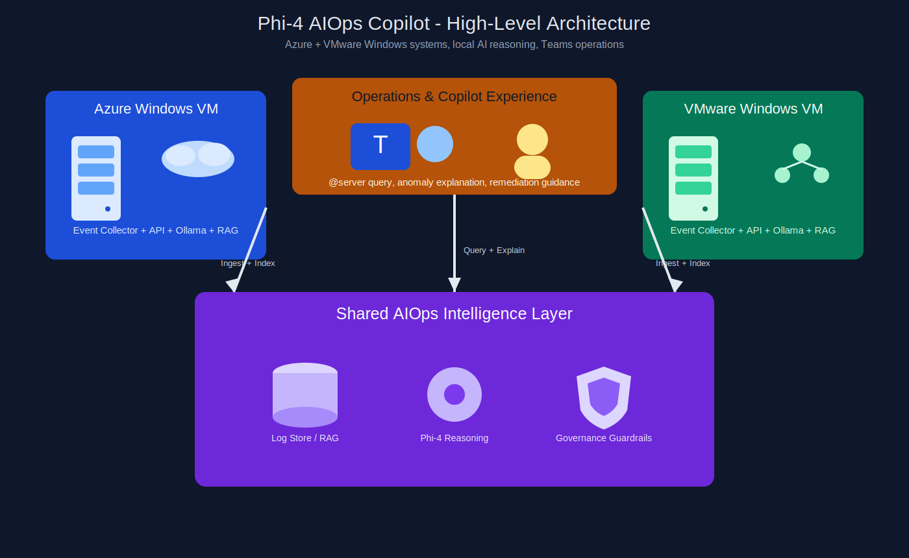
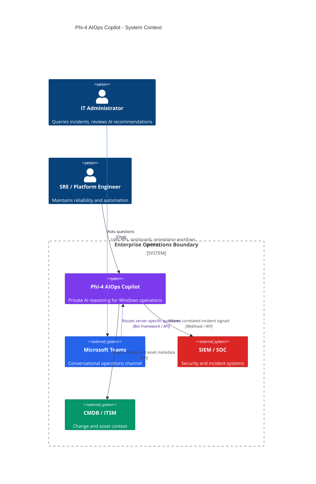
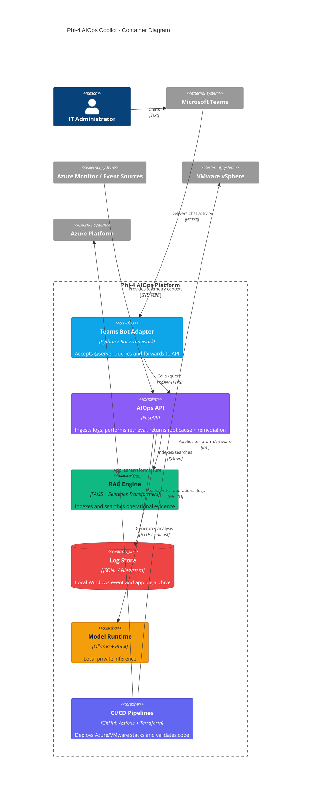
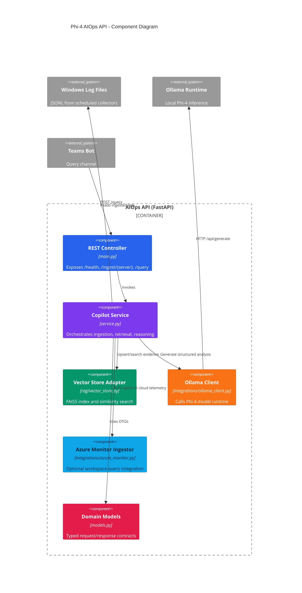
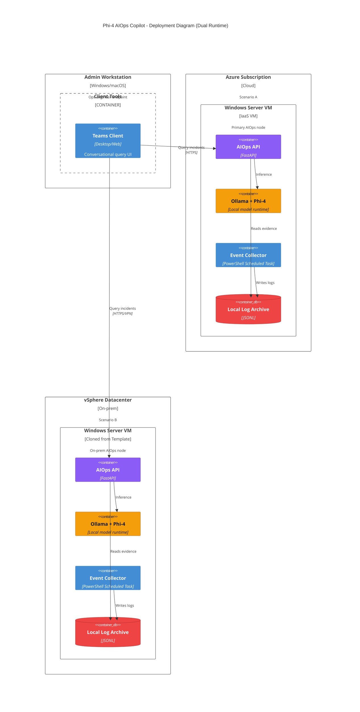

# Phi-4 AIOps Copilot for Windows on VMware and Azure

**Production-ready, privacy-first, enterprise AIOps implementation** that deploys an intelligent operations copilot directly beside your Windows workloads.

If your team is overloaded by dashboards, alerts, and noisy incident channels, this repository helps you move from passive monitoring to **actionable operational reasoning**.

## Why this project matters

This project operationalizes the vision behind *“Small Model, Big Impact: Phi-4 as an Autonomous IT Operations Copilot”* with real deployment artifacts, code, and runbooks.

You get:
- End-to-end Infrastructure as Code for **Azure Windows Server** and **VMware vSphere Windows VM**
- Automated Windows bootstrap for model runtime + log collection
- Local Retrieval-Augmented Generation (RAG) pipeline for correlated diagnostics
- API service administrators can query in plain language
- Microsoft Teams bot integration pattern with `@server-name` routing
- CI/CD pipelines for validation and controlled deployment

---

## Solution architecture

1. **Windows VM** (Azure or VMware) runs operational workloads.
2. **Log collector** exports Windows Event Logs to JSONL.
3. **AIOps API** ingests and vectorizes logs into local FAISS index.
4. **Phi-4 via Ollama** generates root-cause summaries and remediation suggestions.
5. **Teams bot** lets administrators query by server mention (`@win-az-aiops-01`).
6. **Terraform pipelines** provide repeatable, auditable provisioning.

---

## C4 architecture diagrams (Mermaid)

> These diagrams are intentionally colorful to make architecture reviews, stakeholder walkthroughs, and design workshops easier.

## 3D high-level architecture image (SLT/STL-style visual)

Below is a 3D-style high-level architecture illustration you can use in presentations and executive walkthroughs.



### 1) C4 Level 1 — System Context



### 2) C4 Level 2 — Container Diagram



### 3) C4 Level 3 — Component Diagram (AIOps API)



### 4) C4 Level 4-style Deployment View (Azure + VMware)



---

## Repository structure

```text
.
├── docs/wiki/                 # Structured student-style GitHub Wiki documentation
├── terraform/
│   ├── azure/                 # Azure VM + network + monitor workspace + AMA extension
│   └── vmware/                # vSphere VM cloning + guest customization
├── scripts/windows/
│   ├── bootstrap-aiops.ps1    # Installs dependencies + pulls model + schedules collector
│   └── collect-events.ps1     # Exports Windows event logs to JSONL
├── src/aiops_copilot/
│   ├── main.py                # FastAPI endpoints
│   ├── service.py             # Ingestion + retrieval + reasoning flow
│   ├── rag/vector_store.py    # Local FAISS vector store
│   └── integrations/
│       ├── ollama_client.py
│       ├── azure_monitor.py
│       └── teams_bot.py
└── .github/workflows/         # CI + deployment pipelines
```

---

## GitHub Wiki style student guide

For structured, professional, student-friendly documentation, start here:

- [`docs/wiki/Home.md`](docs/wiki/Home.md)

The guide covers architecture, prerequisites, Azure/VMware deployment, bootstrap, API usage, Teams integration, troubleshooting, hardening, and FAQ in a step-by-step learning path.

---

## Prerequisites

- Terraform >= 1.8
- Python 3.11+
- Windows Server 2022/2025 image or template
- Ollama-compatible runtime target on Windows VM
- GitHub Actions secrets configured for your environment
- For Teams bot: Azure Bot registration + messaging endpoint

---

## Scenario A: Deploy on Azure Windows Server (Production path)

### 1) Provision infrastructure

```bash
cd terraform/azure
terraform init
terraform apply \
  -var="vm_admin_username=<admin_user>" \
  -var="vm_admin_password=<strong_password>" \
  -var="allowed_admin_cidr=<your_public_cidr>"
```

Outputs include:
- `vm_public_ip`
- `log_analytics_workspace_id`

### 2) Bootstrap AIOps services on the Windows VM

RDP into the server and run as Administrator:

```powershell
Set-ExecutionPolicy Bypass -Scope Process -Force
cd C:\
# copy scripts/windows/bootstrap-aiops.ps1 and collect-events.ps1 to C:\Phi4AIOps
powershell -ExecutionPolicy Bypass -File C:\Phi4AIOps\bootstrap-aiops.ps1 -OllamaModel "phi4:mini"
```

### 3) Deploy API

```powershell
cd C:\Phi4AIOps
python -m venv venv
.\venv\Scripts\Activate.ps1
pip install -e .
copy .env.example .env
uvicorn aiops_copilot.main:app --host 0.0.0.0 --port 8000
```

### 4) Ingest logs and query

```bash
curl -X POST http://<vm_public_ip>:8000/ingest/win-az-aiops-01
curl -X POST http://<vm_public_ip>:8000/query \
  -H "Content-Type: application/json" \
  -d '{"server":"win-az-aiops-01","question":"Compare last night backup failure with Monday success"}'
```

---

## Scenario B: Deploy on VMware Windows Server (vSphere)

### 1) Prepare template
- Create hardened Windows Server template with VMware Tools.
- Enable WinRM or RDP based on enterprise policy.
- Validate static IP customization is enabled in guest OS.

### 2) Provision VM

```bash
cd terraform/vmware
terraform init
terraform apply \
  -var="vsphere_server=<vcenter_fqdn>" \
  -var="vsphere_user=<svc_account>" \
  -var="vsphere_password=<password>" \
  -var="datacenter=<dc>" \
  -var="cluster=<cluster>" \
  -var="datastore=<datastore>" \
  -var="network=<portgroup>" \
  -var="template_name=<windows_template>" \
  -var="admin_password=<windows_admin_pwd>" \
  -var="ipv4_address=<ip>" \
  -var="ipv4_gateway=<gateway>"
```

### 3) Bootstrap and run the same AIOps stack
Use the same Windows bootstrap and API steps from Azure scenario.

---

## Teams Copilot-style operations workflow

Deploy `src/aiops_copilot/integrations/teams_bot.py` behind your Bot Framework endpoint and set:

```env
AIOPS_API_URL=http://<aiops-api-host>:8000/query
```

Example Team message:

```text
@win-az-aiops-01 What changed between last successful backup and last failed one?
```

The bot returns:
- Root cause hypothesis
- Confidence score
- Plain-language explanation
- Suggested remediation commands

---

## CI/CD and deployment pipelines

- `ci.yml` validates Python package and Terraform syntax.
- `deploy-azure.yml` applies Azure infra from GitHub Actions.
- `deploy-vmware.yml` applies VMware infra from GitHub Actions.

Required GitHub Secrets include (non-exhaustive):
- Azure: `ARM_CLIENT_ID`, `ARM_CLIENT_SECRET`, `ARM_TENANT_ID`, `ARM_SUBSCRIPTION_ID`, `AZURE_VM_ADMIN_USERNAME`, `AZURE_VM_ADMIN_PASSWORD`
- vSphere: `VSPHERE_SERVER`, `VSPHERE_USER`, `VSPHERE_PASSWORD`, `VSPHERE_DATACENTER`, `VSPHERE_CLUSTER`, `VSPHERE_DATASTORE`, `VSPHERE_NETWORK`, `VSPHERE_TEMPLATE`

---

## Security and governance recommendations (for real-world enterprise adoption)

1. Place API behind reverse proxy + mTLS + private network.
2. Use managed identities / Key Vault / Vault for secret distribution.
3. Apply role-based approvals before executing remediations.
4. Add PII scrubbing and retention policy in ingestion pipeline.
5. Sign PowerShell scripts and enforce constrained language mode.
6. Add change correlation data from CMDB + patching tools.
7. Store incident feedback loops to improve retrieval quality.
8. Establish model risk policy (prompt logging, prompt injection controls, hallucination guardrails).

---

## Industry adoption roadmap

To make this platform truly production-grade across banking, healthcare, government, and critical infrastructure:

- Add multi-tenant server groups and RBAC by support tower.
- Introduce policy-as-code for allowed remediation commands.
- Integrate ServiceNow/Jira ticket context into retrieval.
- Add shift-handover summary generator every 8/12 hours.
- Include canary environments and chaos validation for runbooks.
- Publish SLO dashboards for copilot precision, latency, and acceptance rate.

---

## Local development

```bash
python -m venv .venv
source .venv/bin/activate
pip install -e .
uvicorn aiops_copilot.main:app --reload
```

---

## SEO-friendly project keywords

Phi-4 AIOps, Windows Server AIOps Copilot, Azure Windows Terraform, VMware Windows Terraform, private enterprise AI operations, local LLM for IT operations, Teams IT Copilot, autonomous log analysis, production-ready AIOps platform.

---

## License

MIT (see `LICENSE`).
